# ERD 설계 — 상권 분석 에이전트

> 기준: CLAUDE.md §13 (1NF→3NF 정규화, 근거 있는 역정규화만 허용, 고립 테이블 금지)
> 테이블 1개 = Fractal 11-File Set 1개 = AI 위임 단위 (§12)

---

## 1. 그리는 방법 — 3계층 접근

ERD를 한 장에 그리지 않고 **역할 계층으로 나눠** 설계한다. 계층이 곧 데이터 흐름이다.

```
[마스터 계층]   region, district, industry …     ← 모든 엣지가 모이는 허브 (고아 방지 축)
      ↑ FK
[원천 계층]     store, population_stat …          ← 공공데이터 수집 결과 (정규화 대상)
      ↓ 배치 집계
[집계 계층]     region_industry_metric            ← 서비스 조회용 (역정규화 허용 구역)
```

- **마스터**: 변화가 거의 없는 기준 데이터. 모든 테이블은 이 허브(region 또는 industry)에 FK로 연결되어야 한다 → **고립 테이블·고아 컬럼 원천 차단**
- **원천**: 공공데이터를 정규화해서 적재. 여기는 3NF 엄격 적용
- **집계**: 지도·에이전트 응답용 사전 계산. **역정규화는 이 계층에만 허용**하고 근거를 명시

도구: **Mermaid `erDiagram`을 md 파일로 버전 관리** (GitHub 자동 렌더링, 코드 리뷰 가능).
시각 편집이 필요하면 dbdiagram.io(DBML)로 옮기되, 원본은 이 문서로 유지.

---

## 2. ERD 초안 (MVP 15개 테이블)

```mermaid
erDiagram
    %% ── 마스터 계층 ──
    district ||--o{ region : "포함"
    industry ||--o{ industry_subcategory : "세분"
    industry ||--o{ industry_source_code : "코드매핑"

    %% ── 원천 계층 ──
    region ||--o{ store : "위치"
    industry ||--o{ store : "업종"
    industry_subcategory |o--o{ store : "서브카테고리"
    store ||--o{ academy_course : "교습과정(학원만)"
    region ||--o{ population_stat : "인구"
    region ||--o{ sales_estimate : "추정매출(서울)"
    district |o--o{ rent_price : "임대시세(상권 단위 원천 - 자치구 매핑 후속)"
    district ||--o{ tobacco_retailer : "지정관할(보조 테이블)"
    region |o--o{ tobacco_retailer : "위치(공간조인 후 채움)"
    shock_event ||--o{ shock_event_industry : ""
    industry ||--o{ shock_event_industry : ""
    shock_event ||--o{ shock_event_region : ""
    region ||--o{ shock_event_region : ""
    shock_event |o--o{ news_article : "근거기사"
    region |o--o{ news_article : "관련지역"
    funding_program ||--o{ funding_program_industry : ""
    industry ||--o{ funding_program_industry : ""

    %% ── 집계 계층 ──
    region ||--o{ region_industry_metric : ""
    industry ||--o{ region_industry_metric : ""

    district {
        string district_code PK "자치구코드"
        string name
    }
    region {
        string region_code PK "행정동코드"
        string district_code FK
        string name
        string geometry_ref "경계 GeoJSON 경로"
    }
    industry {
        string industry_id PK
        string name "10종"
        string demand_type "수요동인 4유형"
    }
    industry_source_code {
        string id PK
        string industry_id FK
        string source_system "LOCALDATA/NEIS/상가정보"
        string code "원천 업종코드"
    }
    industry_subcategory {
        string subcategory_id PK
        string industry_id FK
        string category_axis "교습계열/미용세분 등"
        string target_group "대상학년 등, nullable"
    }
    store {
        string store_id PK "인허가 관리번호 MNG_NO"
        string name "사업장명 BPLC_NM - 실응답 기반 추가"
        string district_code FK "OPN_ATMY_GRP_CD 매핑 - NOT NULL"
        string region_code FK "nullable - 경계 공간조인 후 채움"
        string industry_id FK
        string subcategory_id FK "nullable"
        float lat "nullable - EPSG5174 to WGS84 변환"
        float lng "nullable"
        date open_date "인허가일자 LCPMT_YMD - nullable"
        date close_date "폐업일자 CLSBIZ_YMD - nullable"
        string status_code "상세영업상태코드 DTL_SALS_STTS_CD"
        string status_name "영업중/폐업/직권말소/전출 등 - 실응답 확인"
        datetime source_updated_at "DAT_UPDT_PNT - 증분 수집 커서"
    }
    academy_course {
        string course_id PK "store_id:연번 - OA-20528 실응답 기반"
        string store_id FK
        string course_name "수강료 항목명 INDV_ATNLC_AMT_CN 또는 교습과정명 TRNG_CRS_LIST_NM - 원문 보존"
        int tuition_fee "수강료 - 공개 항목만, nullable"
        string target_grade "LLM 추출 후속 - 현재 null"
    }
    population_stat {
        string region_code PK "FK, 행정동코드"
        string period PK "YYYYMM (각년 12월 + 최신월)"
        string gender PK "M/F — 계는 합산 도출"
        int age_from PK "5세 구간 시작 (0,5,…,100)"
        int age_to "구간 끝 — 100세 이상은 null"
        int population "주민등록 인구수"
    }
    sales_estimate {
        string id PK
        string region_code FK
        string industry_id FK
        string period
        bigint amount
    }
    rent_price {
        string id PK "building_type:cls_id:period - R-ONE 실응답 기반"
        string building_type "medium_large 중대형 / small 소규모 상가"
        string cls_id "R-ONE 지역 분류 ID (CLS_ID)"
        string region_name "CLS_NM 원문 보존 (예: 테헤란로)"
        string region_path "CLS_FULLNM 원문 (서울>강남>테헤란로)"
        int region_level "1 시도 / 2 권역 / 3 상권"
        string district_code FK "nullable - 원천이 상권 단위라 자치구 미확정, 매핑 후속"
        string period "YYYYQn 분기"
        float rent_per_m2 "임대료 천원/㎡ - nullable"
        float vacancy_rate "공실률 % - nullable"
        string rent_statbl_id "임대료 원천 통계표 ID - 표본 개편(빈티지) 추적"
        string vacancy_statbl_id "공실률 원천 통계표 ID"
    }
    tobacco_retailer {
        string retailer_id PK "관리번호 - 인허가 CSV 실측 유일"
        string name "사업장명"
        string district_code FK "개방자치단체코드 매핑 (opn_authority_code)"
        string region_code FK "nullable - 좌표 공간조인 후 채움 (store 전례)"
        string status_code "상세영업상태코드 0 정상영업 ~ 6 영업정지"
        string status_name "정상영업/폐업처리/지정취소/직권취소 등"
        date designated_date "지정일자 - nullable (실측 76.0%)"
        date permit_date "인허가일자"
        date close_date "폐업일자"
        date cancel_date "인허가취소일자 - 지정취소 폐지 시점"
        float lat "EPSG:5174 to WGS84 변환 - nullable"
        float lng
        string road_address "nullable - 표시용"
        string jibun_address "nullable - 좌표 결측분 지오코딩 대기열"
        datetime source_updated_at "데이터갱신시점"
    }
    interest_rate {
        string id PK "rate_type:period - ECOS 실응답 기반"
        string rate_type "base 기준금리 - 시리즈 확장 대비"
        string period "YYYYMM"
        float rate "연% 값"
        string unit "ECOS UNIT_NAME"
        string stat_code "ECOS 통계코드"
        string item_code "ECOS 항목코드"
    }
    shock_event {
        string event_id PK
        string layer "①정책②거시③트렌드④지역"
        string name
        date start_date
        date end_date "nullable"
        string scope "전국/서울/지역"
        string source_url
    }
    news_article {
        string article_id PK "sha1(url) 20자리"
        string title
        string description "발췌 - 본문 저장 금지"
        string press "nullable - 네이버 응답에 언론사명 없음"
        datetime published_at "실응답 RFC822 datetime"
        string url UK
        string matched_keyword
        string region_code FK "nullable"
        string event_id FK "nullable - shock_event BC 생성 시 컬럼+FK 동시 추가(구현 유보)"
    }
    funding_program {
        string program_id PK "원천 공고 ID(bizinfo pblancId)"
        string source "기업마당(bizinfo) - 소스 확장 대비"
        string title "pblancNm"
        string org "jrsdInsttNm 소관기관"
        string exec_org "excInsttNm 수행기관 - nullable"
        string field_category "pldirSportRealmLclasCodeNm 지원분야 대분류"
        string field_subcategory "pldirSportRealmMlsfcCodeNm 중분류 - nullable"
        string target_text "trgetNm 지원대상 원문 - LLM 추출 원천"
        string hashtags "지역·업종 태그 원문 - LLM 추출 원천"
        string apply_period "reqstBeginEndDe 신청기간 원문"
        date apply_begin "파싱 - nullable(상시 등)"
        date deadline "파싱 - nullable(상시 등)"
        string summary "bsnsSumryCn 태그 제거 발췌 - 본문 전문 저장 금지"
        string url UK "pblancUrl 원문 링크 필수"
        datetime posted_at "creatPnttm - nullable"
        datetime source_updated_at "updtPnttm - nullable"
        boolean is_expired "일 배치 만료 갱신"
    }
    region_industry_metric {
        string id PK
        string region_code FK
        string industry_id FK
        string subcategory_id FK "nullable"
        string period "YYYYQ"
        int store_count
        int open_count
        int close_count
        float growth_rate
        float closure_rate
        float survival_rate_3y
    }
```



(M:N 매핑 3개: `shock_event_industry`, `shock_event_region`, `funding_program_industry` — PK+FK 2개 구조)

`interest_rate`는 region/industry와 직접 엣지가 없는 유일한 예외처럼 보이나,
계산기 유스케이스에서 `rent_price`(district)와 결합되어 사용되므로 **애플리케이션 레벨 엣지**를 §4에 명시해 고립을 해소한다.

**실구현 정정 (2026-09-07, 실데이터 기반 원칙):**
- `rent_price` — 원천(R-ONE 임대동향조사)의 지역 단위가 **자치구가 아니라 상권/권역/시도**로 실확인
  (CLS_FULLNM "서울>강남>테헤란로"). 원천 지역명을 보존(`region_name`/`region_path`/`cls_id`)하고
  `district_code` FK는 nullable(의도된 미연결 — 상권이 자치구 경계와 불일치, 매핑표 구축 후속).
  초안의 `sale_price_avg`(실거래 매매 평균)는 국토부 실거래가 **후속 수집 시 추가** — 실데이터 확인 전 컬럼 유보.
- `interest_rate` — 초안의 `bank_tier`(1군/2군)·`credit_band`(신용등급 구간)·`avg_rate`는
  **은행연합회 공시 대출금리**의 컬럼이지 한국은행 시계열의 것이 아님. 실구현은 ECOS 시계열
  (`rate_type`/`period`/`rate`)로 확정하고, 은행군×신용등급 평균 대출금리는 은행연합회 후속 수집 시
  **별도 테이블(예: loan_rate)로 유보** — 두 데이터는 축(시계열 vs 은행군×신용대 격자)이 달라 한 테이블에 섞지 않는다.
  참고: 계산기 §8.1③의 COFIX 보정 축은 ECOS 미제공 실확인(2026-09-07, 전체 통계표 전수 조회) —
  COFIX는 은행연합회 소비자포털 공시라 후속(은행연합회) 수집 범위로 이동.
- `tobacco_retailer` — **MVP 15테이블 밖 보조 테이블 추가** (2026-09-07, 편의점 축 1단계).
  편의점은 LOCALDATA 단일 인허가 코드가 없어 담배소매인 지정(지자체 거리 제한)이 사실상
  출점 가능 여부를 결정 (brainstorming §3.5). 원천은 인허가 「기타_담배소매업」 서울 아카이브 CSV
  (`data/raw/tobacco_retail/`, 95,402행 실컬럼 기반 — 표준데이터 CSV는 좌표 부재라 배제).
  §13 연결 원칙: `district_code` FK 필수 + `region_code` FK nullable(좌표 공간조인 후 채움 —
  의도된 미연결은 좌표 결측 9.9%분)로 마스터 허브에 연결, 고립 없음.
  store에 합치지 않는 근거: 담배소매인은 점포(업종)가 아니라 **지정 권리** — industry FK가 성립하지
  않고(편의점·슈퍼·가판 복합), 지정일자·취소일자 등 고유 컬럼 축이 다르다.

---

## 3. 정규화 검증 (1NF → 3NF)

**1NF — 반복 그룹 제거:**
- 공고 1건의 대상 업종 여러 개 → 컬럼 나열이 아니라 `funding_program_industry` M:N 행으로
- 인구의 연령대별 수치 → `age_10, age_20…` 컬럼이 아니라 `age_band` 행 단위로
- 업종 1개의 원천 코드 여러 개(예: 편의점 = 담배소매인+상가정보 코드) → `industry_source_code` 분리

**2NF — 부분 종속 제거:**
- `region_industry_metric`의 (region, industry, period) 복합 의미키에서 region 이름·업종명은 키 일부에만 종속 → 마스터 테이블로 분리, 지표 테이블엔 FK만

**3NF — 이행 종속 제거:**
- `store`에 자치구를 두지 않는다: store → region → district로 결정되는 이행 종속
- `district`를 별도 테이블로 분리한 이유: region에 district_name을 두면 3NF 위반.
  부수 효과 — 노래방·당구장처럼 표본이 얇은 업종의 **자치구 단위 집계 축**으로도 사용 (§brainstorming 3.5)

**고아 컬럼·고아 레코드 방지 규칙:**
- 모든 테이블은 마스터 허브(region/district/industry)까지 FK 경로가 존재해야 한다 (위 다이어그램에서 검증)
- FK는 주석이 아니라 **실제 DB 제약(FOREIGN KEY)으로 강제** — 고아 레코드 차단
- nullable FK는 "의도된 미연결"만 허용하고 사유를 컬럼 주석에 명시 (예: `news_article.event_id` — 이벤트로 승격 전 수집 상태)
- 어떤 테이블과도 JOIN되지 않는 컬럼이 리뷰에서 발견되면 설계 오류로 간주하고 제거

---

## 4. 역정규화 목록 (명시적 근거 필수 — §13)

| 위치 | 역정규화 내용 | 근거 |
|---|---|---|
| `region_industry_metric` 테이블 전체 | store에서 계산 가능한 집계를 사전 저장 | 지도 단계구분도 API가 요청마다 수십만 store 행을 집계하면 latency 목표(-40%) 불달성. 배치(일 1회)로 충분한 신선도 |
| `region_industry_metric.store_count` 등 파생 수치 | growth_rate는 open/close/store_count에서 유도 가능 | 프론트 차트가 매번 계산하지 않도록 저장. 원천(store)이 진실이고 지표는 재생성 가능 — 불일치 시 배치 재실행으로 복구 |
| `store.status` | open_date/close_date에서 유도 가능 | 상태 필터 쿼리 빈도가 압도적 → 인덱스 걸린 상태 컬럼 유지 |
| `interest_rate` ↔ 지표 테이블 비연결 | 계산기 전용 독립 시계열 | 상권과 무관한 전국 공시 데이터. 계산기 유스케이스에서 rent_price(district)와 애플리케이션 조인 |

**허용 안 되는 역정규화 예시** (리뷰 시 반려): store에 region_name 저장, metric에 업종명 저장 —
조회 편의 외 근거 없음. JOIN 1회로 해결되는 것은 역정규화 사유가 아니다.

---

## 5. 다음 단계

- [ ] 팀 리뷰: 테이블 15개 구성 + 역정규화 4건 근거 승인
- [ ] 업종코드 매핑표 확정 → `industry_source_code` 시드 데이터 작성
- [ ] Alembic 마이그레이션 초안 (마스터 → 원천 → 집계 순서로 생성)
- [ ] 테이블별 Fractal 11-File Set 구현 순서 결정 (제안: region → industry → store → metric)
