# ERD 설계 — 상권 분석 에이전트

> 기준: CLAUDE.md §13 (1NF→3NF 정규화, 근거 있는 역정규화만 허용, 고립 테이블 금지)
> 테이블 1개 = Fractal 11-File Set 1개 = AI 위임 단위 (§12)

---

## 1. 그리는 방법 — 3계층 접근

ERD를 한 장에 그리지 않고 **역할 계층으로 나눠** 설계한다. 계층이 곧 데이터 흐름이다.

```
[마스터 계층]   region, district, industry …     ← 모든 엣지가 모이는 허브 (고아 방지 축)
      ↑ FK
[원천 계층]     store, population_stat …          ← 공공데이터 수집 결과 (정규화 대상)
      ↓ 배치 집계
[집계 계층]     region_industry_metric            ← 서비스 조회용 (역정규화 허용 구역)
```

- **마스터**: 변화가 거의 없는 기준 데이터. 모든 테이블은 이 허브(region 또는 industry)에 FK로 연결되어야 한다 → **고립 테이블·고아 컬럼 원천 차단**
- **원천**: 공공데이터를 정규화해서 적재. 여기는 3NF 엄격 적용
- **집계**: 지도·에이전트 응답용 사전 계산. **역정규화는 이 계층에만 허용**하고 근거를 명시

도구: **Mermaid `erDiagram`을 md 파일로 버전 관리** (GitHub 자동 렌더링, 코드 리뷰 가능).
시각 편집이 필요하면 dbdiagram.io(DBML)로 옮기되, 원본은 이 문서로 유지.

---

## 2. ERD 초안 (MVP 15개 테이블)

> 설계 초안이다. 실구현 최종본(실DB 스키마 기준 21테이블)은 **§6**을 본다.

```mermaid
erDiagram
    %% ── 마스터 계층 ──
    district ||--o{ region : "포함"
    industry ||--o{ industry_subcategory : "세분"
    industry ||--o{ industry_source_code : "코드매핑"

    %% ── 원천 계층 ──
    region ||--o{ store : "위치"
    industry ||--o{ store : "업종"
    industry_subcategory |o--o{ store : "서브카테고리"
    store ||--o{ academy_course : "교습과정(학원만)"
    region ||--o{ population_stat : "인구"
    region ||--o{ sales_estimate : "추정매출(서울)"
    district |o--o{ rent_price : "임대시세(상권 단위 원천 - 자치구 매핑 후속)"
    district ||--o{ tobacco_retailer : "지정관할(보조 테이블)"
    region |o--o{ tobacco_retailer : "위치(공간조인 후 채움)"
    region ||--o{ convenience_store : "수집 단위(보조 테이블)"
    district ||--o{ childcare_center : "수집 단위(보조 테이블)"
    region |o--o{ childcare_center : "위치(공간조인 후 채움)"
    childcare_center ||--o{ childcare_center_stat : "기준일별 현황"
    shock_event ||--o{ shock_event_industry : ""
    industry ||--o{ shock_event_industry : ""
    shock_event ||--o{ shock_event_region : ""
    region ||--o{ shock_event_region : ""
    shock_event |o--o{ news_article : "근거기사"
    region |o--o{ news_article : "관련지역"
    funding_program ||--o{ funding_program_industry : ""
    industry ||--o{ funding_program_industry : ""

    %% ── 집계 계층 ──
    region ||--o{ region_industry_metric : ""
    industry ||--o{ region_industry_metric : ""

    district {
        string district_code PK "자치구코드"
        string name
    }
    region {
        string region_code PK "행정동코드"
        string district_code FK
        string name
        string geometry_ref "경계 GeoJSON 경로"
    }
    industry {
        string industry_id PK
        string name "10종"
        string demand_type "수요동인 4유형"
    }
    industry_source_code {
        string id PK
        string industry_id FK
        string source_system "LOCALDATA/NEIS/상가정보"
        string code "원천 업종코드"
    }
    industry_subcategory {
        string subcategory_id PK
        string industry_id FK
        string category_axis "교습계열/미용세분 등"
        string target_group "대상학년 등, nullable"
    }
    store {
        string store_id PK "인허가 관리번호 MNG_NO"
        string name "사업장명 BPLC_NM - 실응답 기반 추가"
        string district_code FK "OPN_ATMY_GRP_CD 매핑 - NOT NULL"
        string region_code FK "nullable - 경계 공간조인 후 채움"
        string industry_id FK
        string subcategory_id FK "nullable"
        float lat "nullable - EPSG5174 to WGS84 변환"
        float lng "nullable"
        date open_date "인허가일자 LCPMT_YMD - nullable"
        date close_date "폐업일자 CLSBIZ_YMD - nullable"
        string status_code "상세영업상태코드 DTL_SALS_STTS_CD"
        string status_name "영업중/폐업/직권말소/전출 등 - 실응답 확인"
        datetime source_updated_at "DAT_UPDT_PNT - 증분 수집 커서"
    }
    academy_course {
        string course_id PK "store_id:연번 - OA-20528 실응답 기반"
        string store_id FK
        string course_name "수강료 항목명 INDV_ATNLC_AMT_CN 또는 교습과정명 TRNG_CRS_LIST_NM - 원문 보존"
        int tuition_fee "수강료 - 공개 항목만, nullable"
        string target_grade "LLM 추출 후속 - 현재 null"
    }
    population_stat {
        string region_code PK "FK, 행정동코드"
        string period PK "YYYYMM (각년 12월 + 최신월)"
        string gender PK "M/F — 계는 합산 도출"
        int age_from PK "5세 구간 시작 (0,5,…,100)"
        int age_to "구간 끝 — 100세 이상은 null"
        int population "주민등록 인구수"
    }
    sales_estimate {
        string id PK
        string region_code FK
        string industry_id FK
        string period
        bigint amount
    }
    rent_price {
        string id PK "building_type:cls_id:period - R-ONE 실응답 기반"
        string building_type "medium_large 중대형 / small 소규모 상가"
        string cls_id "R-ONE 지역 분류 ID (CLS_ID)"
        string region_name "CLS_NM 원문 보존 (예: 테헤란로)"
        string region_path "CLS_FULLNM 원문 (서울>강남>테헤란로)"
        int region_level "1 시도 / 2 권역 / 3 상권"
        string district_code FK "nullable - 원천이 상권 단위라 자치구 미확정, 매핑 후속"
        string period "YYYYQn 분기"
        float rent_per_m2 "임대료 천원/㎡ - nullable"
        float vacancy_rate "공실률 % - nullable"
        string rent_statbl_id "임대료 원천 통계표 ID - 표본 개편(빈티지) 추적"
        string vacancy_statbl_id "공실률 원천 통계표 ID"
    }
    tobacco_retailer {
        string retailer_id PK "관리번호 - 인허가 CSV 실측 유일"
        string name "사업장명"
        string district_code FK "개방자치단체코드 매핑 (opn_authority_code)"
        string region_code FK "nullable - 좌표 공간조인 후 채움 (store 전례)"
        string status_code "상세영업상태코드 0 정상영업 ~ 6 영업정지"
        string status_name "정상영업/폐업처리/지정취소/직권취소 등"
        date designated_date "지정일자 - nullable (실측 76.0%)"
        date permit_date "인허가일자"
        date close_date "폐업일자"
        date cancel_date "인허가취소일자 - 지정취소 폐지 시점"
        float lat "EPSG:5174 to WGS84 변환 - nullable"
        float lng
        string road_address "nullable - 표시용"
        string jibun_address "nullable - 좌표 결측분 지오코딩 대기열"
        datetime source_updated_at "데이터갱신시점"
    }
    convenience_store {
        string store_id PK "bizesId 상가업소번호 - 소진공 상가정보 실측 유일"
        string name "bizesNm 상호명"
        string branch_name "brchNm 지점명 - nullable"
        string brand "상호 기반 추출 GS25/CU/세븐일레븐/이마트24/미니스톱 - 미확인 nullable"
        string region_code FK "요청 행정동 - adongCd 8자리 = region_code 앞 8자리 유일 실측"
        float lat "WGS84 원천 제공 - nullable 방어"
        float lng
        string road_address "rdnmAdr - nullable"
        string jibun_address "lnoAdr - nullable"
        string source_stdr_ym "원천 기준연월 stdrYm - 소실 분석 빈티지 구분"
        date first_seen_on "최초 관측일 - 신규 출점 신호"
        date last_seen_on "최근 관측일 - 정지 시 소실(폐점 추정 후보)"
    }
    childcare_center {
        string center_id PK "stcode 어린이집 코드 - cpmsapi030 실측 유일"
        string name "crname"
        string type_name "crtypename 국공립/가정/민간/직장/법인·단체등/협동/사회복지법인"
        string status_name "crstatusname 정상/재개/휴지 - 공란 nullable"
        string district_code FK "요청 arcode 5자리"
        string region_code FK "좌표 공간조인 - 등록 자치구 밖 판정은 미기입 - nullable"
        string address "craddr"
        string zipcode "nullable"
        string tel "crtelno - nullable"
        float lat "la WGS84 - nullable"
        float lng "lo"
        date approved_on "crcnfmdt 인가일"
        date paused_from "crpausebegindt 휴지 시작 - nullable"
        date paused_until "crpauseenddt 휴지 종료 - nullable"
        date abolished_on "crabldt 폐지일 - nullable(원천이 폐지 시설 미반환)"
        date first_seen_on "최초 관측일"
        date last_seen_on "최근 관측일 - 정지 시 소실(폐원 추정 후보)"
    }
    childcare_center_stat {
        string center_id PK "FK childcare_center"
        date base_date PK "datastdrdt 원천 기준일"
        int capacity "crcapat 정원"
        int child_count "crchcnt 현원 = CHILD_CNT_TOT"
        int waiting_count "EW_CNT_TOT 입소대기 - 공란 nullable"
        int class_count "CLASS_CNT_TOT 반 수"
        int staff_count "chcrtescnt 보육교직원 = EM_CNT_TOT"
    }
    interest_rate {
        string id PK "rate_type:period - ECOS 실응답 기반"
        string rate_type "base 기준금리 - 시리즈 확장 대비"
        string period "YYYYMM"
        float rate "연% 값"
        string unit "ECOS UNIT_NAME"
        string stat_code "ECOS 통계코드"
        string item_code "ECOS 항목코드"
    }
    shock_event {
        string event_id PK
        string layer "①정책②거시③트렌드④지역"
        string name
        date start_date
        date end_date "nullable"
        string scope "전국/서울/지역"
        string source_url
    }
    news_article {
        string article_id PK "sha1(url) 20자리"
        string title
        string description "발췌 - 본문 저장 금지"
        string press "nullable - 네이버 응답에 언론사명 없음"
        datetime published_at "실응답 RFC822 datetime"
        string url UK
        string matched_keyword
        string region_code FK "nullable"
        string event_id FK "nullable - shock_event BC 생성 시 컬럼+FK 동시 추가(구현 유보)"
    }
    funding_program {
        string program_id PK "원천 공고 ID(bizinfo pblancId)"
        string source "기업마당(bizinfo) - 소스 확장 대비"
        string title "pblancNm"
        string org "jrsdInsttNm 소관기관"
        string exec_org "excInsttNm 수행기관 - nullable"
        string field_category "pldirSportRealmLclasCodeNm 지원분야 대분류"
        string field_subcategory "pldirSportRealmMlsfcCodeNm 중분류 - nullable"
        string target_text "trgetNm 지원대상 원문 - LLM 추출 원천"
        string hashtags "지역·업종 태그 원문 - LLM 추출 원천"
        string apply_period "reqstBeginEndDe 신청기간 원문"
        date apply_begin "파싱 - nullable(상시 등)"
        date deadline "파싱 - nullable(상시 등)"
        string summary "bsnsSumryCn 태그 제거 발췌 - 본문 전문 저장 금지"
        string url UK "pblancUrl 원문 링크 필수"
        datetime posted_at "creatPnttm - nullable"
        datetime source_updated_at "updtPnttm - nullable"
        boolean is_expired "일 배치 만료 갱신"
    }
    region_industry_metric {
        string id PK
        string region_code FK
        string industry_id FK
        string subcategory_id FK "nullable"
        string period "YYYYQ"
        int store_count
        int open_count "nullable - 스냅샷 원천(어린이집·편의점)은 개폐업 이력 없음"
        int close_count "nullable - 동일"
        float growth_rate
        float closure_rate
        float survival_rate_3y
    }
```



(M:N 매핑 3개: `shock_event_industry`, `shock_event_region`, `funding_program_industry` — PK+FK 2개 구조)

`interest_rate`는 region/industry와 직접 엣지가 없는 유일한 예외처럼 보이나,
계산기 유스케이스에서 `rent_price`(district)와 결합되어 사용되므로 **애플리케이션 레벨 엣지**를 §4에 명시해 고립을 해소한다.

**실구현 정정 (2026-09-07, 실데이터 기반 원칙):**
- `rent_price` — 원천(R-ONE 임대동향조사)의 지역 단위가 **자치구가 아니라 상권/권역/시도**로 실확인
  (CLS_FULLNM "서울>강남>테헤란로"). 원천 지역명을 보존(`region_name`/`region_path`/`cls_id`)하고
  `district_code` FK는 nullable(의도된 미연결 — 상권이 자치구 경계와 불일치, 매핑표 구축 후속).
  초안의 `sale_price_avg`(실거래 매매 평균)는 국토부 실거래가 **후속 수집 시 추가** — 실데이터 확인 전 컬럼 유보.
- `interest_rate` — 초안의 `bank_tier`(1군/2군)·`credit_band`(신용등급 구간)·`avg_rate`는
  **은행연합회 공시 대출금리**의 컬럼이지 한국은행 시계열의 것이 아님. 실구현은 ECOS 시계열
  (`rate_type`/`period`/`rate`)로 확정하고, 은행군×신용등급 평균 대출금리는 은행연합회 후속 수집 시
  **별도 테이블(예: loan_rate)로 유보** — 두 데이터는 축(시계열 vs 은행군×신용대 격자)이 달라 한 테이블에 섞지 않는다.
  참고: 계산기 §8.1③의 COFIX 보정 축은 ECOS 미제공 실확인(2026-09-07, 전체 통계표 전수 조회) —
  COFIX는 은행연합회 소비자포털 공시라 후속(은행연합회) 수집 범위로 이동.
- `tobacco_retailer` — **MVP 15테이블 밖 보조 테이블 추가** (2026-09-07, 편의점 축 1단계).
  편의점은 LOCALDATA 단일 인허가 코드가 없어 담배소매인 지정(지자체 거리 제한)이 사실상
  출점 가능 여부를 결정 (brainstorming §3.5). 원천은 인허가 「기타_담배소매업」 서울 아카이브 CSV
  (`data/raw/tobacco_retail/`, 95,402행 실컬럼 기반 — 표준데이터 CSV는 좌표 부재라 배제).
  §13 연결 원칙: `district_code` FK 필수 + `region_code` FK nullable(좌표 공간조인 후 채움 —
  의도된 미연결은 좌표 결측 9.9%분)로 마스터 허브에 연결, 고립 없음.
  store에 합치지 않는 근거: 담배소매인은 점포(업종)가 아니라 **지정 권리** — industry FK가 성립하지
  않고(편의점·슈퍼·가판 복합), 지정일자·취소일자 등 고유 컬럼 축이 다르다.
- `convenience_store` — **MVP 15테이블 밖 보조 테이블 추가** (2026-09-07, 편의점 축 2단계).
  원천은 소진공 상가정보 sdsc2 `storeListInDong`(indsSclsCd=G20405 체인화 편의점) × 행정동 427회.
  **store에 합치지 않는 근거**: 상가정보는 개폐업 시계열 분석 불가(api.md §2-3 — 상가업소번호
  재생성 이력) → store에 섞으면 `region_industry_metric`의 open/close 지표가 오염된다.
  이 테이블은 "현재 편의점 분포·경쟁밀도" 전용이고, 개폐업 이력은 `tobacco_retailer`가 담당.
  §13 연결 원칙: `region_code` FK 필수(수집 자체가 행정동 단위 — adongCd 8자리 프리픽스가
  427개 region에서 유일함을 DB 실측)로 마스터 허브 연결, 고립 없음. district는 region 경유
  이행 종속이라 두지 않음(3NF — store 전례). `brand`는 상호 기반 추출 역정규화(브랜드 분포
  조회 축 — 원본 상호 보존으로 재추출 가능). 관측 필드 `first_seen_on`/`last_seen_on`은
  broker 전례의 스냅샷 소실 패턴 — 소실(last_seen 정지)="폐점 추정 후보"의 후속 분석 근거.
- `childcare_center` / `childcare_center_stat` — **MVP 15테이블 밖 보조 테이블 2종 추가**
  (2026-09-17, 어린이집 축). 원천은 어린이집정보공개포털 cpmsapi030 × 자치구 25회
  (운영계정 실응답 73필드 기반 — 서울 3,940건 실적재). 원천이 폐지 시설을 반환하지 않아
  인허가 개폐업 이력이 없으므로 **store에 합치지 않음**(convenience 근거와 동일 — open/close 지표 오염).
  §13 연결 원칙: `district_code` FK 필수(요청 arcode) + `region_code` FK nullable(좌표 공간조인,
  등록 자치구 밖 판정은 좌표 오류로 보고 미기입 — tobacco 전례)로 마스터 허브 연결, stat은
  center FK로 연결 — 고립 없음.
  **시설/현황 분리 근거(2NF·이력)**: 정원·현원·대기·반·교직원은 (시설, 기준일)에 종속되고 시점마다
  변한다 — 시설 행에 덮어쓰면 가동률 추이가 복구 불가로 소실되므로 PK(center_id, base_date) 이력 행.
  **1NF**: 연령별 반·아동·대기(CLASS/CHILD/EW_CNT_00~05…)와 교직원 직종·근속 분포(EM_CNT_*)는
  컬럼 나열이 되므로 이번에는 수집하지 않음 — 소비처가 생기면 age_band 행 테이블로 추가.
  `sidoname`/`sigunname`은 district 경유 이행 종속이라 두지 않음(3NF). 대표자명(CRREPNAME)은
  가정 어린이집에서 개인 실명이라 미수집.

---

## 3. 정규화 검증 (1NF → 3NF)

**1NF — 반복 그룹 제거:**
- 공고 1건의 대상 업종 여러 개 → 컬럼 나열이 아니라 `funding_program_industry` M:N 행으로
- 인구의 연령대별 수치 → `age_10, age_20…` 컬럼이 아니라 `age_band` 행 단위로
- 업종 1개의 원천 코드 여러 개(예: 편의점 = 담배소매인+상가정보 코드) → `industry_source_code` 분리

**2NF — 부분 종속 제거:**
- `region_industry_metric`의 (region, industry, period) 복합 의미키에서 region 이름·업종명은 키 일부에만 종속 → 마스터 테이블로 분리, 지표 테이블엔 FK만

**3NF — 이행 종속 제거:**
- `store`에 자치구를 두지 않는다: store → region → district로 결정되는 이행 종속
- `district`를 별도 테이블로 분리한 이유: region에 district_name을 두면 3NF 위반.
  부수 효과 — 노래방·당구장처럼 표본이 얇은 업종의 **자치구 단위 집계 축**으로도 사용 (§brainstorming 3.5)

**고아 컬럼·고아 레코드 방지 규칙:**
- 모든 테이블은 마스터 허브(region/district/industry)까지 FK 경로가 존재해야 한다 (위 다이어그램에서 검증)
- FK는 주석이 아니라 **실제 DB 제약(FOREIGN KEY)으로 강제** — 고아 레코드 차단
- nullable FK는 "의도된 미연결"만 허용하고 사유를 컬럼 주석에 명시 (예: `news_article.event_id` — 이벤트로 승격 전 수집 상태)
- 어떤 테이블과도 JOIN되지 않는 컬럼이 리뷰에서 발견되면 설계 오류로 간주하고 제거

---

## 4. 역정규화 목록 (명시적 근거 필수 — §13)

| 위치 | 역정규화 내용 | 근거 |
|---|---|---|
| `region_industry_metric` 테이블 전체 | store에서 계산 가능한 집계를 사전 저장 | 지도 단계구분도 API가 요청마다 수십만 store 행을 집계하면 latency 목표(-40%) 불달성. 배치(일 1회)로 충분한 신선도 |
| `region_industry_metric.store_count` 등 파생 수치 | growth_rate는 open/close/store_count에서 유도 가능 | 프론트 차트가 매번 계산하지 않도록 저장. 원천(store)이 진실이고 지표는 재생성 가능 — 불일치 시 배치 재실행으로 복구 |
| `store.status` | open_date/close_date에서 유도 가능 | 상태 필터 쿼리 빈도가 압도적 → 인덱스 걸린 상태 컬럼 유지 |
| `interest_rate` ↔ 지표 테이블 비연결 | 계산기 전용 독립 시계열 | 상권과 무관한 전국 공시 데이터. 계산기 유스케이스에서 rent_price(district)와 애플리케이션 조인 |

**허용 안 되는 역정규화 예시** (리뷰 시 반려): store에 region_name 저장, metric에 업종명 저장 —
조회 편의 외 근거 없음. JOIN 1회로 해결되는 것은 역정규화 사유가 아니다.

---

## 5. 다음 단계

- [ ] 팀 리뷰: 테이블 15개 구성 + 역정규화 4건 근거 승인
- [ ] 업종코드 매핑표 확정 → `industry_source_code` 시드 데이터 작성
- [ ] Alembic 마이그레이션 초안 (마스터 → 원천 → 집계 순서로 생성)
- [ ] 테이블별 Fractal 11-File Set 구현 순서 결정 (제안: region → industry → store → metric)

---

## 6. 최종 ERD — 실DB 스키마 기준 (2026-09-23)

> 원천: 운영 DB `information_schema`(컬럼·PK·UK·FK) 실조회. **36테이블**(`alembic_version` 제외).
> 2026-09-17의 21테이블에 commerce 3·neighborhood 8·metric 파생 2·agent 2 = **15테이블**을 더했다(T0-4).
> 실선 = DB `FOREIGN KEY` 제약, 점선 = 애플리케이션 레벨 엣지(DB 제약 없음 — 사유는 §6.2).

```mermaid
erDiagram
    %% ── 마스터 계층 ──
    district ||--o{ region : "포함"
    region ||--o{ population_stat : "인구"
    industry ||--o{ industry_subcategory : "세분"
    industry ||--o{ industry_source_code : "코드매핑"

    %% ── 원천 계층: 인허가 ──
    district ||--o{ store : "관할"
    region |o--o{ store : "위치(공간조인)"
    industry ||--o{ store : "업종"
    industry_subcategory |o--o{ store : "서브카테고리"
    store ||--o{ academy_course : "교습과정"
    district ||--o{ tobacco_retailer : "지정관할"
    region |o--o{ tobacco_retailer : "위치(공간조인)"

    %% ── 원천 계층: 스냅샷 ──
    region ||--o{ convenience_store : "수집 단위"
    district ||--o{ childcare_center : "수집 단위"
    region |o--o{ childcare_center : "위치(공간조인)"
    childcare_center ||--o{ childcare_center_stat : "기준일별 현황"

    %% ── 원천 계층: 외생 변수 ──
    district |o--o{ rent_price : "매핑 후속"
    shock_event ||--o{ shock_event_industry : ""
    industry ||--o{ shock_event_industry : ""
    shock_event ||--o{ shock_event_region : ""
    region ||--o{ shock_event_region : ""
    region |o--o{ news_article : "관련지역"
    interest_rate }o..o{ rent_price : "계산기 앱 조인"

    %% ── 집계 계층 ──
    region ||--o{ region_industry_metric : ""
    industry ||--o{ region_industry_metric : ""
    store ||..o{ region_industry_metric : "배치 집계(개폐업)"
    convenience_store ||..o{ region_industry_metric : "스냅샷 점포수"
    childcare_center ||..o{ region_industry_metric : "스냅샷 점포수"

    %% ── 검색 계층 (RAG) ──
    region |o--o{ rag_chunk : "지역 필터"
    news_article ||..o{ rag_chunk : "source_type=news"
    funding_program ||..o{ rag_chunk : "source_type=funding"

    %% ── 원천 계층: 서울 상권분석서비스 — 업종 실적 (commerce, 동×업종×분기) ──
    region |o--o{ region_commerce_sales : "region_code (옛 행정동 3개 NULL)"
    region |o--o{ region_commerce_store : ""
    region |o--o{ region_commerce_sales_breakdown : ""
    region_commerce_sales ||--o{ region_commerce_sales_breakdown : "복합 FK (adstrd, code, quarter)"
    industry_source_code }o..o{ region_commerce_sales : "source_system=seoul_commercial 코드매핑"

    %% ── 원천 계층: 서울 상권분석서비스 — 동네 맥락 (neighborhood, 동×분기, 업종 축 없음) ──
    region |o--o{ region_footfall_quarter : ""
    region |o--o{ region_population_quarter : ""
    region |o--o{ region_household_quarter : ""
    region |o--o{ region_housing_average_quarter : ""
    region |o--o{ region_facility_quarter : ""
    region |o--o{ region_spending_quarter : ""
    region |o--o{ region_commerce_change : ""
    seoul_commerce_change_baseline ||--o{ region_commerce_change : "year_quarter (2NF 분리)"

    %% ── 파생 계층 (metric 확장, 배치 재생성) ──
    region ||--o{ region_profile_quarter : ""
    region ||--o{ region_industry_hour_gap_quarter : ""
    industry ||--o{ region_industry_hour_gap_quarter : ""
    region_footfall_quarter ||..o{ region_profile_quarter : "4분기 평활 판정"
    region_population_quarter ||..o{ region_profile_quarter : ""
    region_spending_quarter ||..o{ region_profile_quarter : ""
    region_facility_quarter ||..o{ region_profile_quarter : ""
    region_footfall_quarter ||..o{ region_industry_hour_gap_quarter : "시간강도"
    region_commerce_sales_breakdown ||..o{ region_industry_hour_gap_quarter : "시간강도"

    %% ── 에이전트 계층 ──
    analysis_report ||--o{ llm_usage : "턴별 토큰"
    region |o..o{ analysis_report : "region_code (FK 없음)"

    district {
        string district_code PK "자치구코드"
        string name
        string opn_authority_code UK "개방자치단체코드 - nullable"
    }
    region {
        string region_code PK "행정동코드"
        string district_code FK
        string name
        string geometry_ref "nullable"
    }
    population_stat {
        string region_code PK, FK
        string period PK "YYYYMM"
        string gender PK "M/F"
        int age_from PK "5세 구간 시작"
        int age_to "nullable - 100세 이상"
        int population
    }
    industry {
        string industry_id PK
        string name
        string demand_type "수요동인 4유형"
    }
    industry_subcategory {
        string subcategory_id PK
        string industry_id FK
        string category_axis
        string target_group "nullable"
    }
    industry_source_code {
        int id PK
        string industry_id FK "UK(industry_id, source_system, code)"
        string source_system
        string code
    }
    store {
        string store_id PK "MNG_NO"
        string name
        string industry_id FK
        string district_code FK
        string region_code FK "nullable"
        string subcategory_id FK "nullable"
        date open_date "nullable"
        date close_date "nullable"
        string status_code
        string status_name
        float lat "nullable"
        float lng "nullable"
        datetime source_updated_at "증분 커서"
    }
    academy_course {
        string course_id PK
        string store_id FK
        string course_name
        int tuition_fee "nullable"
        string target_grade "nullable"
    }
    tobacco_retailer {
        string retailer_id PK
        string name
        string district_code FK
        string region_code FK "nullable"
        string status_code
        string status_name
        date designated_date "nullable"
        date permit_date "nullable"
        date close_date "nullable"
        date cancel_date "nullable"
        float lat "nullable"
        float lng "nullable"
        string road_address "nullable"
        string jibun_address "nullable"
        datetime source_updated_at
    }
    convenience_store {
        string store_id PK "bizesId"
        string name
        string branch_name "nullable"
        string brand "nullable - 상호 추출"
        string region_code FK
        float lat "nullable"
        float lng "nullable"
        string road_address "nullable"
        string jibun_address "nullable"
        string source_stdr_ym
        date first_seen_on
        date last_seen_on
    }
    childcare_center {
        string center_id PK "stcode"
        string name
        string type_name
        string status_name "nullable"
        string district_code FK
        string region_code FK "nullable"
        string address
        string zipcode "nullable"
        string tel "nullable"
        float lat "nullable"
        float lng "nullable"
        date approved_on "nullable"
        date paused_from "nullable"
        date paused_until "nullable"
        date abolished_on "nullable"
        date first_seen_on
        date last_seen_on
    }
    childcare_center_stat {
        string center_id PK, FK
        date base_date PK
        int capacity
        int child_count
        int waiting_count "nullable"
        int class_count
        int staff_count
    }
    rent_price {
        string id PK "building_type:cls_id:period"
        string building_type
        string cls_id
        string region_name
        string region_path
        int region_level
        string district_code FK "nullable"
        string period "YYYYQn"
        float rent_per_m2 "nullable"
        float vacancy_rate "nullable"
        string rent_statbl_id "nullable"
        string vacancy_statbl_id "nullable"
    }
    interest_rate {
        string id PK "rate_type:period"
        string rate_type
        string period "YYYYMM"
        float rate
        string unit
        string stat_code
        string item_code
    }
    shock_event {
        string event_id PK
        string layer
        string name
        date start_date
        date end_date "nullable"
        string scope
        string source
        string source_url "nullable"
        string description "nullable"
    }
    shock_event_industry {
        string event_id PK, FK
        string industry_id PK, FK
        string severity
    }
    shock_event_region {
        string event_id PK, FK
        string region_code PK, FK
    }
    news_article {
        string article_id PK "sha1(url) 20자리"
        string title
        string description
        datetime published_at
        string url UK
        string matched_keyword
        string press "nullable"
        string region_code FK "nullable"
    }
    funding_program {
        string program_id PK "pblancId"
        string source
        string title
        string org
        string url UK
        string apply_period
        string exec_org "nullable"
        string field_category "nullable"
        string field_subcategory "nullable"
        string target_text "nullable"
        string hashtags "nullable"
        date apply_begin "nullable"
        date deadline "nullable"
        string summary "nullable"
        datetime posted_at "nullable"
        datetime source_updated_at "nullable"
        boolean is_expired
    }
    region_industry_metric {
        string region_code PK, FK
        string industry_id PK, FK
        int year PK
        int store_count
        int open_count "nullable - 스냅샷 원천"
        int close_count "nullable - 스냅샷 원천"
        float closure_rate "nullable"
        float growth_rate "nullable"
    }
    rag_chunk {
        string chunk_id PK
        string source_type "news / funding"
        string source_id "원천 PK - 다형 참조, IX(source_type, source_id)"
        string content
        vector embedding "vector(1536) - nullable"
        string embedded_by "nullable - 임베딩 모델명"
        datetime published_at "nullable"
        string org "nullable"
        string url "nullable"
        string region_code FK "nullable"
    }
    region_commerce_sales {
        string adstrd_code PK "원천 행정동 8자리"
        string service_industry_code PK "CS 코드"
        string year_quarter PK "YYYYQ"
        string region_code FK "nullable - 의도된 역정규화"
        bigint sales_amount "nullable"
        bigint sales_count "nullable"
    }
    region_commerce_store {
        string adstrd_code PK
        string service_industry_code PK
        string year_quarter PK
        string region_code FK "nullable"
        int store_count "nullable"
        int similar_industry_store_count "nullable"
        float open_rate "nullable"
        int open_store_count "nullable"
        float close_rate "nullable"
        int close_store_count "nullable"
        int franchise_store_count "nullable"
    }
    region_commerce_sales_breakdown {
        string adstrd_code PK, FK "복합 FK → region_commerce_sales"
        string service_industry_code PK, FK
        string year_quarter PK, FK
        string dim_type PK "dow|hour|gender|age|weekpart"
        string dim_key PK "00_06 등 정규화 표기"
        string region_code FK "nullable"
        bigint amount "nullable"
        bigint count "nullable"
    }
    region_footfall_quarter {
        string adstrd_code PK
        string year_quarter PK
        string dim_type PK "total|gender|age|hour|dow"
        string dim_key PK
        string region_code FK "nullable"
        bigint headcount "nullable"
    }
    region_population_quarter {
        string adstrd_code PK
        string year_quarter PK
        string population_type PK "worker|resident"
        string dim_type PK "total|gender|age|gender_age"
        string dim_key PK
        string region_code FK "nullable"
        bigint headcount "nullable - 직장은 414동뿐"
    }
    region_household_quarter {
        string adstrd_code PK
        string year_quarter PK
        string dim_type PK "household|apartment_complex|area|price"
        string dim_key PK
        string region_code FK "nullable"
        bigint value "nullable - apartment 가구수는 전행 0"
    }
    region_housing_average_quarter {
        string adstrd_code PK
        string year_quarter PK
        string region_code FK "nullable"
        float avg_area_m2 "nullable"
        bigint avg_price "원 - nullable, 편차 극단"
    }
    region_facility_quarter {
        string adstrd_code PK
        string year_quarter PK
        string facility_type PK "total + 19종"
        string region_code FK "nullable"
        int facility_count "nullable - total ≠ 19종 합"
    }
    region_spending_quarter {
        string adstrd_code PK
        string year_quarter PK
        string spending_category PK "total + 10종"
        string region_code FK "nullable"
        bigint amount "원 - 가맹점 결제(발생지)"
    }
    seoul_commerce_change_baseline {
        string year_quarter PK
        float seoul_operating_months "nullable"
        float seoul_closed_months "nullable"
    }
    region_commerce_change {
        string adstrd_code PK
        string year_quarter PK, FK "→ seoul_commerce_change_baseline"
        string change_code "HH|HL|LH|LL - nullable"
        string change_name "nullable - code에 함수종속(§13 예외)"
        float operating_months "nullable"
        float closed_months "nullable"
        string region_code FK "nullable"
    }
    region_profile_quarter {
        string region_code PK, FK
        string year_quarter PK
        string neighborhood_type "office|campus|dining|hub|residential|mixed"
        text type_reason "실측 수치가 박힌 근거 문장"
        string time_label "morning|day|evening|night|flat - nullable"
        string peak_block "nullable"
        string trough_block "nullable"
        float worker_resident_ratio "nullable - 직장 결측 동"
        float weekend_index "nullable"
        float night_index "00_06 시간강도 - nullable"
        float footfall_20s_share "nullable"
        float fnb_share "nullable"
        int facility_total "nullable"
        int resident_total "nullable"
    }
    region_industry_hour_gap_quarter {
        string region_code PK, FK
        string industry_id PK, FK
        string year_quarter PK
        string hour_band PK "00_06 … 21_24"
        float footfall_intensity "1.0 = 24h 균등"
        float sales_intensity
        float gap "sales − footfall"
    }
    analysis_report {
        string id PK "analysis_id uuid"
        string region_code "FK 없음"
        string industry
        string question "nullable"
        text report_md
        text citations_json
        string model
        datetime created_at
    }
    llm_usage {
        int id PK
        string analysis_id FK
        string model
        int input_tokens
        int output_tokens
        int latency_ms
        datetime created_at
    }
```



### 6.1 적재 현황 (2026-09-23, `count(*)` 실측)

| 계층 | 테이블 (행 수) |
|---|---|
| 마스터 | district 25 · region 427 · industry 10 · industry_subcategory 8 · industry_source_code 25 · population_stat 142,632 |
| 원천(인허가) | store 348,996 · academy_course 64,415 · tobacco_retailer 95,402 |
| 원천(스냅샷) | convenience_store 9,395 · childcare_center 3,940 · childcare_center_stat 7,880 |
| 원천(외생) | rent_price 3,638 · interest_rate 365 · shock_event 26 · shock_event_industry 107 · shock_event_region **0** · news_article 5,808 · funding_program 2,032 |
| 원천(상권분석 — 업종 실적) | region_commerce_sales 343,167 · region_commerce_store 704,470 · region_commerce_sales_breakdown **7,892,841** |
| 원천(상권분석 — 동네 맥락) | region_footfall_quarter 205,700 · region_population_quarter 387,618 · region_household_quarter 149,353 · region_housing_average_quarter 9,331 · region_facility_quarter 187,000 · region_spending_quarter 102,850 · region_commerce_change 9,350 · seoul_commerce_change_baseline 22 |
| 집계·파생 | region_industry_metric 27,829 · region_profile_quarter 9,284 · region_industry_hour_gap_quarter 342,078 |
| 검색 | rag_chunk 7,695 |
| 에이전트 | analysis_report 7 · llm_usage 7 |

상권분석서비스 계열 11테이블 합계 **약 999만 행**(설계서 `2026-09-23-commerce-bc-design.md`·`…-neighborhood-bc-design.md`). 파생 2종은 `python -m apps.metric.adapter.inbound.cli.build_region_profiles`로 배치 재생성한다(33초, 멱등).

### 6.2 초안(§2) 대비 차이

| 구분 | 내용 |
|---|---|
| **추가** | `rag_chunk` — RAG 검색 청크(pgvector 1536차원). §2 초안에 없던 검색 계층 |
| **미구현** | `funding_program_industry`(공고↔업종 M:N) — 테이블 없음. `sales_estimate`(추정매출)는 `region_commerce_sales`로 구현됨(2026-09-23) |
| **스키마 변경** | `region_industry_metric` — 대리키 `id`·`subcategory_id`·`survival_rate_3y` 없음, `period`(YYYYQ) → `year`(int), PK = (region_code, industry_id, year) 복합키 |
| **스키마 변경** | `district.opn_authority_code`(UK) 추가, `industry_source_code.id`는 int + UK(industry_id, source_system, code) |
| **스키마 변경** | `shock_event.source`·`description`, `shock_event_industry.severity` 추가 |
| **유보 유지** | `news_article.event_id` — shock_event 승격 시 추가 (§2 주석 그대로) |

**점선(애플리케이션 레벨) 엣지 사유:**
- `rag_chunk.source_id` — `source_type`에 따라 `news_article` 또는 `funding_program`의 PK를 가리키는 다형 참조라 단일 FK 제약을 걸 수 없다.
- `region_industry_metric` ← store / convenience_store / childcare_center — 배치 집계(`apps/metric` 게이트웨이)로 생성되는 파생 관계이고 행 단위 참조가 아니다.
- `interest_rate` ↔ `rent_price` — §4 역정규화 목록의 계산기 앱 조인.
- `region_profile_quarter` · `region_industry_hour_gap_quarter` ← neighborhood·commerce 원천 — 배치 파생(`apps/metric`이 게이트웨이로 읽어 매 배치 임계값을 재계산). 행 단위 참조가 아니다.
- `industry_source_code` ↔ `region_commerce_sales` — `service_industry_code`가 CS 코드이고 업종 매핑은 `source_system='seoul_commercial'` 행을 경유한다(cafe 3·hair_salon 3·academy 4 코드 합산). 원천 코드를 PK로 보존해야 하므로 FK를 걸지 않는다.
- `analysis_report.region_code` — 리포트는 삭제된 지역에도 남아야 하는 이력 데이터라 FK 없음.
- `region_code`가 nullable인 상권분석 11테이블 — 원천에만 있는 옛 행정동 3개(`11230536` 용신동·`11680740` 일원2동·`11740520` 상일동)를 버리지 않고 NULL로 보존한다. 조회 시 `region_code IS NOT NULL`이 원칙.

**§13 연결 원칙 점검 결과 (DB FK 기준):**
- `funding_program` — DB FK가 하나도 없다. `rag_chunk` 다형 참조로만 연결되며, 업종 허브 연결을 맡을 `funding_program_industry`가 미구현이다 → **후속 구현 대상**.
- `interest_rate` — DB FK 없음. §4에 근거를 명시한 의도된 예외.
- `shock_event_region` — 테이블·FK는 있으나 적재 0건.
